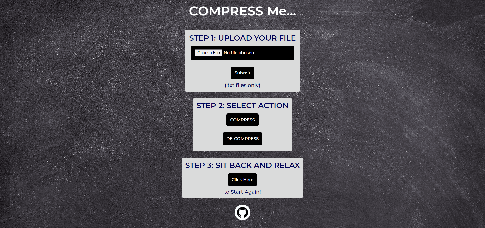
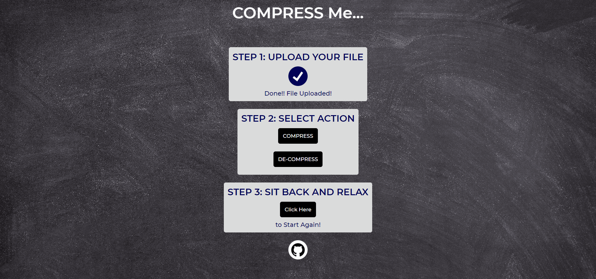
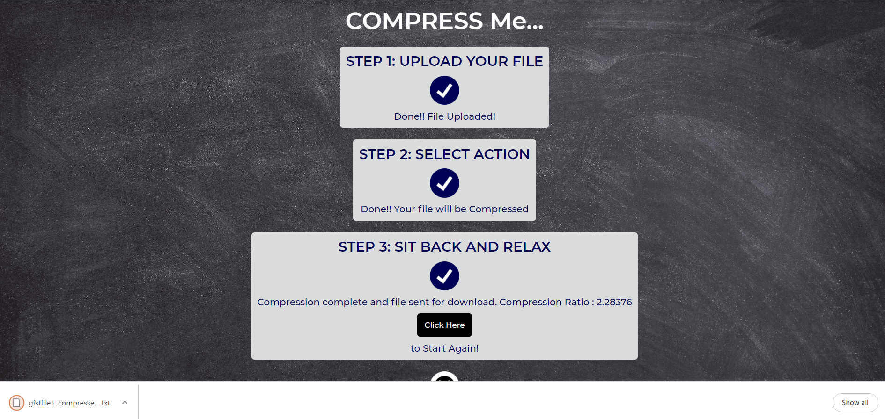
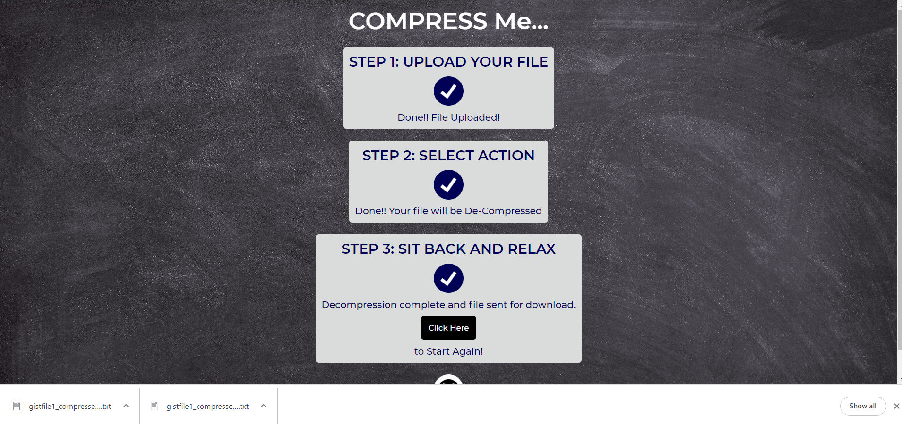

# CompressMe
Huffman Coding based .txt file compressor

* Made with JavaScript , HTML and CSS
* Uses Huffman Coding for Text Compression
* Live Demo : https://coder-saab001.github.io/CompressMe/

## About

* Performs Lossless compression and decompression of .txt files using Huffman Coding technique .
* Each character is assigned a unique variable length binary code, instead of its 8-bit representation, with more frequent characters having smaller codes. A Huffman Tree is created and stored to generate and decode these codes.
* Compression ratio usually improves as the file size increases.
* The website is made responsive (with HTML and CSS ) and interactive (with JavaScript ) .

## User Interface

* Breaks down the process into three steps:

* Step 1 : Upload Your File

* Step 2 : Select Action

* Step 3 : Sit Back and Relax
    * Required file gets downloaded automatically when process is complete

    * Compression - Compression Ratio is also displayed 
 
    

    * De-compression
 
    

* Additional Instructions and Warnings are provided if the above steps are not followed correctly

* Website is Responsive

